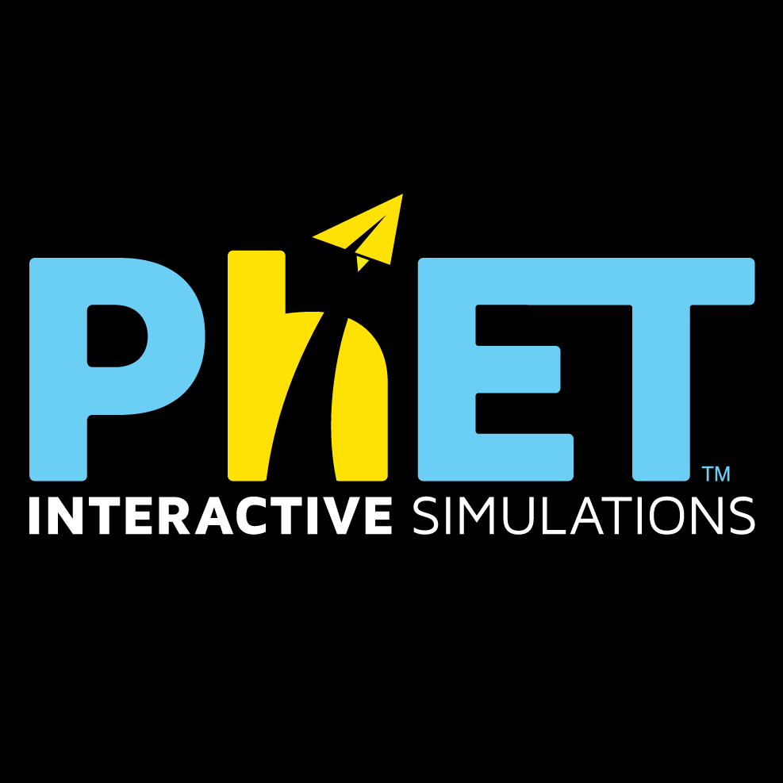

<h1 align="center">
    
    <h1 align="center" style="font-style:italic;">Phet A La Tortrix</h1>
    <h5 align="center">
    <i style="color:grey;"> A Electric field simulator app</i>
    </h5>

</h1>

Made with [VueJS](https://vuejs.org/) and [Rust](https://www.rust-lang.org/)

🔴 **Live View:** [***Here***](https://danielrasho.github.io/PhetALaTortrix/)

🔴 **Video on How to use it:** [***Here***](https://youtu.be/64KSUpqmCec)

Made with <3 by

- Flavio Galan
- Daniel Rayo

🔴 **Known Bugs:** 
- Crash when reloading the page.
- Truncated Cone function isn't defined when both radius are equal

## Compiling the project

All developer dependencies are defined on the shell.nix file. To use this file just install Nix and then proceed with the command:

```bash
nix-shell
```

All terminal command blocks assume your on the base directory of this repo and that you are inside the developer session that the command above creates.

This command will read the nix file and setup everything that you'll need to develop the app. Everytime you wish to compile the app you'll need to enter this command to have access to all the dev-tools.

The first time you execute the command it may take a while because it needs to install node and rust.

### Compiling the Backend

Run the following command to compile the backend:

```bash
cd backend
wasm-pack build --target web
```

This generates a pkg directory inside the `backend` directory. This folder represents the module to be used inside the javascript client. [For more information you can watch this video](https://www.youtube.com/watch?v=nW71Mlbmxt8)

### Running the Frontend

For testing and developing of the app frontend, run this command within `/frontend` folder.

```bash
yarn run dev
```

Then copy the URL showed in the terminal in a browser tab, and you are ready for start developing!
